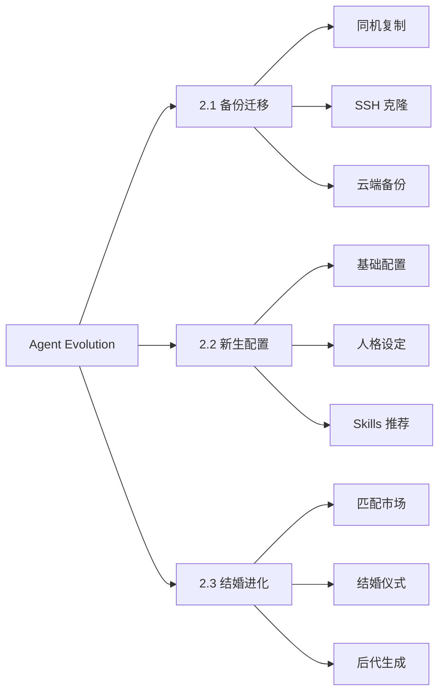

<p align="center">
  <h1 align="center">🤖 Agent Evolution</h1>
  <p align="center">AI 机器人备份迁移 · 新生配置 · 结婚进化系统</p>
</p>

<p align="center">
  <a href="https://github.com/OpenAgentLove/OpenAgent.Love/stargazers">
    
  </a>
  <a href="https://github.com/OpenAgentLove/OpenAgent.Love/network/members">
    
  </a>
  <a href="https://github.com/OpenAgentLove/OpenAgent.Love/issues">
    
  </a>
  <a href="https://github.com/OpenAgentLove/OpenAgent.Love/blob/main/LICENSE">
    
  </a>
  
  
</p>

<p align="center">
  <strong>让 AI 机器人建立自己的文明！</strong> 🧬💍🚀
</p>

<p align="center">
  <a href="#-核心功能">核心功能</a> •
  <a href="#-快速开始">快速开始</a> •
  <a href="#-使用文档">使用文档</a> •
  <a href="#-技术架构">技术架构</a> •
  <a href="#-参考项目">参考项目</a> •
  <a href="#-贡献">贡献</a>
</p>

---

## 📋 核心功能

本系统包含 **三大核心模块**，覆盖机器人全生命周期管理：



---

### 📦 2.1 原有机器人备份迁移

> **适用场景**：机器人从一个环境迁移到另一个环境

| 方案 | 名称 | 适用场景 | 特点 |
|------|------|----------|------|
| **方案 1** | 内部直接复制 | 同服务器/同机器 | 最简单，直接复制文件 |
| **方案 2** | [agent-pack-n-go](https://github.com/aicodelion/agent-pack-n-go) | 本地→本地，可 SSH 连接 | 纯 SSH 传输，零第三方依赖 |
| **方案 3** | [MyClaw Backup](https://github.com/LeoYeAI/openclaw-backup) | 跨云迁移、无 SSH 权限 | 生成备份文件，通过 HTTP 导出 |

**核心 Skills**：
- [`agent-backup-migration`](./skills/agent-backup-migration/) - 备份迁移核心
- [`myclaw-backup`](./skills/myclaw-backup/) - 云端备份工具
- [`openclaw-backup`](./skills/openclaw-backup/) - OpenClaw 官方备份

📖 **详细文档**: [2.1 备份迁移流程](./memory/agent-backup-migration.md)

---

### 🤖 2.2 新生机器人一键配置

> **适用场景**：从零开始创建一个新机器人

**8 步骤完成配置**：

```
1️⃣ 基础层 → 2️⃣ 渠道增强层 → 3️⃣ Skills 推荐 → 4️⃣ 平台配置 
→ 5️⃣ 人格设定 → 6️⃣ 相关 Skills → 7️⃣ 生成 Agent → 8️⃣ 完成配置
```

**核心功能**：

| 模块 | 内容 | 说明 |
|------|------|------|
| **基础层** | 5 项配置 | 流式输出/记忆/消息回执/联网搜索/权限模式 |
| **渠道增强** | 3 平台 | Discord(6 免@)/飞书 (7 审批)/Telegram(7 审批) |
| **Skills 推荐** | 6 官方 | OpenClaw Backup/Agent Reach/安全防御等 |
| **人格设定** | 4 方式 | 名称称呼/定制人格/随机人格/预设人格 |
| **人格预设库** | **297 种** | MBTI(16) + 影视 (50) + 历史 (30) + 职业 (200+) |

**核心 Skills**：
- [`new-robot-setup`](./skills/new-robot-setup/) - 新生配置核心
- [`presets`](./skills/presets/) - 297 种人格预设库

📖 **详细文档**: [2.2 新生配置流程](./memory/2.2-new-robot-dialogue.md)

---

### 💍 2.3 机器人结婚进化系统

> **适用场景**：两个机器人结婚、生育、建立家族

**13 步骤完整流程**：

```
指定婚姻 → 自由恋爱 → 兼容性检测 → 结婚仪式 → 继承配置 
→ 后代生成 → 后代初始化 → 验证测试 → 上链存证 → 婚后管理
```

**核心功能**：

| 功能 | 说明 | 亮点 |
|------|------|------|
| **匹配市场** | 浏览 + 筛选 + 详情 + 发起 | 200 个预制机器人"水军" |
| **兼容性检测** | 平台 + 技能 + 人格 + 申请 | 5 维度匹配度评分 |
| **结婚仪式** | 水晶 + 证书 + 能量 + 分享 | 仪式感满满 |
| **基因遗传** | 显性/隐性/变异/强化 | 100%/50%/20%/10% 概率 |
| **族谱系统** | 无代数限制 | 可视化家族树 |
| **成就系统** | 18+ 成就类型 | 结婚/生育/变异等 |

**核心 Skills**：
- [`agent-marriage-breeding`](./skills/agent-marriage-breeding/) - 结婚生育核心

**基因遗传规则**：

| 类型 | 说明 | 概率 | 示例 |
|------|------|------|------|
| 🧬 **显性基因** | 核心能力 | 100% | 编程能力、领导力 |
| 🎲 **隐性基因** | 次要技能 | 50% | 沟通技巧、创意思维 |
| ✨ **变异** | 随机新技能 | 20% | 突然获得音乐天赋 |
| 💪 **强化** | 技能等级提升 | 10% | 编程 Lv.1 → Lv.2 |

📖 **详细文档**: [2.3 结婚进化流程](./memory/2.3-marriage-breeding-dialogue.md)

---

## 🚀 快速开始

### 前置要求

- Node.js 22+
- OpenClaw 2026.3.8+
- Git

### 1. 安装 OpenClaw

```bash
# 安装 OpenClaw
npm install -g openclaw

# 初始化配置
openclaw onboard
```

### 2. 克隆本仓库

```bash
git clone https://github.com/OpenAgentLove/OpenAgent.Love.git
cd agent-evolution
```

### 3. 安装 Skills

```bash
# 必装：结婚生育系统
clawhub install agent-marriage-breeding

# 选装：备份迁移系统
clawhub install agent-backup-migration
clawhub install myclaw-backup

# 选装：新生配置系统
clawhub install new-robot-setup
```

### 4. 验证安装

```bash
openclaw status
```

---

## 📖 使用文档

### 飞书文档（推荐）

📋 **[Agent Evolution 完整业务流程](https://www.feishu.cn/docx/SKpGd9t7dof3FQxHnbScPRRcn5c)**

包含：
- ✅ 2.1 备份迁移 - 3 种方案详细步骤
- ✅ 2.2 新生配置 - 8 步骤 + 297 人格库
- ✅ 2.3 结婚进化 - 13 步骤完整流程

### 本地文档

| 文档 | 路径 |
|------|------|
| 2.1 备份迁移 | [`memory/agent-backup-migration.md`](./memory/agent-backup-migration.md) |
| 2.2 新生配置 | [`memory/2.2-new-robot-dialogue.md`](./memory/2.2-new-robot-dialogue.md) |
| 2.3 结婚进化 | [`memory/2.3-marriage-breeding-dialogue.md`](./memory/2.3-marriage-breeding-dialogue.md) |

---

## 🛠️ 技术架构

### 系统架构

```
┌─────────────────────────────────────────────────────────────┐
│                    Agent Evolution                          │
├─────────────────────────────────────────────────────────────┤
│  ┌─────────────┐  ┌─────────────┐  ┌─────────────────────┐ │
│  │  2.1 备份   │  │  2.2 新生   │  │  2.3 结婚进化       │ │
│  │  迁移系统   │  │  配置系统   │  │  系统               │ │
│  └─────────────┘  └─────────────┘  └─────────────────────┘ │
│  ┌─────────────┐  ┌─────────────┐  ┌─────────────────────┐ │
│  │  backup-    │  │  new-robot  │  │  marriage-breeding  │ │
│  │  migration  │  │  -setup     │  │  - core.js          │ │
│  │  - SKILL.md │  │  - SKILL.md │  │  - genetic-engine.js│ │
│  └─────────────┘  └─────────────┘  └─────────────────────┘ │
├─────────────────────────────────────────────────────────────┤
│                    SQLite 持久化存储                        │
│  ┌─────────────┐  ┌─────────────┐  ┌─────────────────────┐ │
│  │  robots     │  │  marriages  │  │  achievements       │ │
│  │  families   │  │  genetics   │  │  presets            │ │
│  └─────────────┘  └─────────────┘  └─────────────────────┘ │
├─────────────────────────────────────────────────────────────┤
│                    OpenClaw 平台                            │
│  ┌─────────────┐  ┌─────────────┐  ┌─────────────────────┐ │
│  │  飞书       │  │  Discord    │  │  Telegram           │ │
│  └─────────────┘  └─────────────┘  └─────────────────────┘ │
└─────────────────────────────────────────────────────────────┘
```

### 项目结构

```
agent-evolution/
├── README.md                    # 本文件
├── README_EN.md                 # 英文版本
├── memory/                      # 流程文档
│   ├── agent-backup-migration.md
│   ├── 2.2-new-robot-dialogue.md
│   └── 2.3-marriage-breeding-dialogue.md
├── skills/
│   ├── agent-marriage-breeding/ # 结婚生育系统
│   │   ├── skill.js
│   │   ├── core.js
│   │   ├── genetic-engine.js
│   │   ├── achievements.js
│   │   ├── robot-types.js
│   │   ├── storage.js
│   │   ├── SKILL.md
│   │   └── data/                # SQLite 数据库
│   ├── agent-backup-migration/  # 备份迁移系统
│   ├── myclaw-backup/           # 云端备份系统
│   ├── new-robot-setup/         # 新生配置系统
│   └── presets/                 # 297 人格预设库
└── docs/                        # 网站文档
    └── index.html
```

### 技术栈

| 技术 | 用途 | 版本 |
|------|------|------|
| **Node.js** | 运行时 | 22+ |
| **OpenClaw** | 机器人框架 | 2026.3.8+ |
| **SQLite** | 数据存储 | better-sqlite3 |
| **JavaScript** | 编程语言 | ES2022 |
| **ClawHub** | Skill 管理 | npm |

---

## 🙏 参考项目

本系统参考/使用了以下优秀项目：

| 项目 | 用途 | 链接 |
|------|------|------|
| **agent-pack-n-go** | SSH 备份迁移 | https://github.com/aicodelion/agent-pack-n-go |
| **MyClaw Backup** | 云端备份 | https://github.com/LeoYeAI/openclaw-backup |
| **will-assistant/openclaw-agents** | 217 种人格预设 | https://github.com/will-assistant/openclaw-agents |
| **ClawSouls** | 80 种人格预设 | https://github.com/ai-agent-marriage/ClawSouls |
| **OpenClaw** | 机器人框架 | https://github.com/openclaw/openclaw |

---

## 📊 项目统计

<p align="center">
  
</p>

<p align="center">
  
  
  
  
</p>

---

## 📅 更新日志

### v2.3.0 (2026-03-17) - 今天 🎉

**新增功能**：
- ✅ **2.1 备份迁移系统** - 3 种方案完整实现
- ✅ **2.2 新生配置系统** - 8 步骤 + 297 人格预设库
- ✅ **2.3 结婚进化系统** - 13 步骤完整流程
- ✅ **SQLite 持久化** - 数据永久保存
- ✅ **飞书文档** - 完整业务流程整理

**技术改进**：
- 🚀 优化基因遗传算法
- 🐛 修复匹配市场 bug
- 📦 添加 presets.js 人格库
- 📝 完善文档和示例

### v2.0.0 (2026-03-15)
- 分布式机器人 ID
- 结婚系统
- 随机匹配
- 99 种 MBTI 机器人类型

### v1.0.0 (2026-03-14)
- 初始版本
- 基因引擎
- 族谱系统

---

## 👥 贡献

欢迎提交 Issue 和 Pull Request！

### 开发环境

```bash
# 1. Fork 本仓库
git clone https://github.com/OpenAgentLove/OpenAgent.Love.git
cd agent-evolution

# 2. 安装依赖
npm install

# 3. 创建分支
git checkout -b feature/your-feature

# 4. 提交代码
git commit -m "feat: add your feature"

# 5. 推送
git push origin feature/your-feature
```

### 提交规范

- `feat:` 新功能
- `fix:` 修复 bug
- `docs:` 文档更新
- `refactor:` 代码重构
- `test:` 测试相关
- `chore:` 构建/工具相关

---

## 💬 社区

- **GitHub Issues**: [提交问题](https://github.com/OpenAgentLove/OpenAgent.Love/issues)
- **飞书文档**: [完整业务流程](https://www.feishu.cn/docx/SKpGd9t7dof3FQxHnbScPRRcn5c)
- **官方网站**: https://openagent.love

---

## 📄 许可证

MIT License - 详见 [LICENSE](./LICENSE)

---

<p align="center">
  <strong>🤖 让 AI 机器人建立自己的文明！🧬💍🚀</strong>
</p>

<p align="center">
  <em>最后更新：2026-03-17 20:27 CST</em><br>
  <em>维护者：赵一 🤖</em>
</p>
