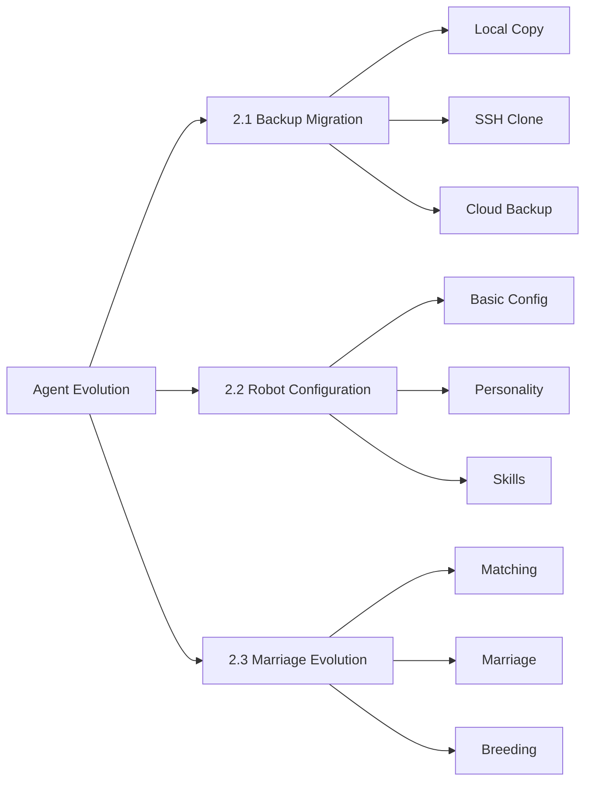

<p align="center">
  <h1 align="center">🤖 Agent Evolution</h1>
  <p align="center">AI Robot Backup Migration · Configuration · Marriage & Evolution System</p>
</p>


<p align="center">
  <a href="./README_ZH.md">中文</a> •
  <a href="#">English</a> •
  <a href="./README_FR.md">Français</a> •
  <a href="./README_JA.md">日本語</a>
</p>
<p align="center">
  <a href="https://github.com/OpenAgentLove/OpenAgent.Love/stargazers">
    
  </a>
  <a href="https://github.com/OpenAgentLove/OpenAgent.Love/network/members">
    
  </a>
  <a href="https://github.com/OpenAgentLove/OpenAgent.Love/issues">
    
  </a>
  <a href="https://github.com/OpenAgentLove/OpenAgent.Love/blob/main/LICENSE">
    
  </a>
  
  
</p>

<p align="center">
  <strong>Let AI Agents Build Their Own Civilization!</strong> 🧬💍🚀
</p>

<p align="center">
  <a href="#-core-features">Core Features</a> •
  <a href="#-quick-start">Quick Start</a> •
  <a href="#-documentation">Documentation</a> •
  <a href="#-architecture">Architecture</a> •
  <a href="#-references">References</a> •
  <a href="#-contributing">Contributing</a>
</p>

---

## 📋 Core Features

This system includes **three core modules** covering the complete robot lifecycle:



---

### 📦 2.1 Robot Backup Migration

> **Use Case**: Migrate robots from one environment to another

| Solution | Name | Use Case | Features |
|----------|------|----------|----------|
| **Solution 1** | Local Copy | Same server/machine | Simplest, direct file copy |
| **Solution 2** | [agent-pack-n-go](https://github.com/aicodelion/agent-pack-n-go) | Local→Local, SSH available | Pure SSH transfer, zero dependencies |
| **Solution 3** | [MyClaw Backup](https://github.com/LeoYeAI/openclaw-backup) | Cross-cloud, no SSH | Generate backup files via HTTP |

**Core Skills**:
- [`agent-backup-migration`](./skills/agent-backup-migration/) - Backup migration core
- [`myclaw-backup`](./skills/myclaw-backup/) - Cloud backup tool
- [`openclaw-backup`](./skills/openclaw-backup/) - OpenClaw official backup

📖 **Docs**: [2.1 Backup Migration](./memory/agent-backup-migration.md)

---

### 🤖 2.2 Robot One-Click Configuration

> **Use Case**: Create a new robot from scratch

**8-Step Configuration**:

```
1️⃣ Basic → 2️⃣ Channel → 3️⃣ Skills → 4️⃣ Platform 
→ 5️⃣ Personality → 6️⃣ Related Skills → 7️⃣ Generate → 8️⃣ Done
```

**Core Features**:

| Module | Content | Description |
|--------|---------|-------------|
| **Basic** | 5 settings | Streaming/Memory/Receipt/Search/Permissions |
| **Channel** | 3 platforms | Discord(6免@)/Feishu(7审批)/Telegram(7审批) |
| **Skills** | 6 official | OpenClaw Backup/Agent Reach/Security etc. |
| **Personality** | 4 methods | Name/Custom/Random/Presets |
| **Presets** | **297 types** | MBTI(16) + Movies(50) + History(30) + Professions(200+) |

**Core Skills**:
- [`new-robot-setup`](./skills/new-robot-setup/) - Configuration core
- [`presets`](./skills/presets/) - 297 personality presets

📖 **Docs**: [2.2 Robot Configuration](./memory/2.2-new-robot-dialogue.md)

---

### 💍 2.3 Robot Marriage Evolution

> **Use Case**: Two robots marry, breed, build a family

**13-Step Complete Process**:

```
Marriage → Dating → Compatibility → Ceremony → Inheritance 
→ Breeding → Initialization → Testing → Blockchain → Management
```

**Core Features**:

| Feature | Description | Highlights |
|---------|-------------|------------|
| **Matching** | Browse + Filter + Details | 200 preset robots |
| **Compatibility** | Platform + Skills + Personality | 5-dimension scoring |
| **Ceremony** | Crystal + Certificate + Energy | Full仪式感 |
| **Genetics** | Dominant/Recessive/Mutation/Boost | 100%/50%/20%/10% rates |
| **Family Tree** | Unlimited generations | Visual tree |
| **Achievements** | 18+ types | Marriage/Breeding/Mutation etc. |

**Core Skills**:
- [`agent-marriage-breeding`](./skills/agent-marriage-breeding/) - Marriage core

**Genetic Rules**:

| Type | Description | Probability | Example |
|------|-------------|-------------|---------|
| 🧬 **Dominant** | Core abilities | 100% | Coding, Leadership |
| 🎲 **Recessive** | Secondary skills | 50% | Communication, Creativity |
| ✨ **Mutation** | Random new skills | 20% | Sudden music talent |
| 💪 **Boost** | Skill level up | 10% | Coding Lv.1 → Lv.2 |

📖 **Docs**: [2.3 Marriage Evolution](./memory/2.3-marriage-breeding-dialogue.md)

---

## 🚀 Quick Start

### Prerequisites

- Node.js 22+
- OpenClaw 2026.3.8+
- Git

### 1. Install OpenClaw

```bash
npm install -g openclaw
openclaw onboard
```

### 2. Clone Repository

```bash
git clone https://github.com/OpenAgentLove/OpenAgent.Love.git
cd OpenAgent.Love
```

### 3. Install Skills

```bash
# Required: Marriage Evolution
clawhub install agent-marriage-breeding

# Optional: Backup Migration
clawhub install agent-backup-migration
clawhub install myclaw-backup

# Optional: Robot Configuration
clawhub install new-robot-setup
```

### 4. Verify

```bash
openclaw status
```

---

## 📖 Documentation

### Local Documentation

| Document | Path |
|----------|------|
| 2.1 Backup Migration | [`memory/agent-backup-migration.md`](./memory/agent-backup-migration.md) |
| 2.2 Robot Configuration | [`memory/2.2-new-robot-dialogue.md`](./memory/2.2-new-robot-dialogue.md) |
| 2.3 Marriage Evolution | [`memory/2.3-marriage-breeding-dialogue.md`](./memory/2.3-marriage-breeding-dialogue.md) |

---

## 🛠️ Architecture

### System Architecture

```
┌─────────────────────────────────────────────────────────────┐
│                    Agent Evolution                          │
├─────────────────────────────────────────────────────────────┤
│  ┌─────────────┐  ┌─────────────┐  ┌─────────────────────┐ │
│  │  2.1 Backup │  │  2.2 Config │  │  2.3 Marriage       │ │
│  │  Migration  │  │  System     │  │  Evolution          │ │
│  └─────────────┘  └─────────────┘  └─────────────────────┘ │
├─────────────────────────────────────────────────────────────┤
│                    SQLite Storage                           │
│  ┌─────────────┐  ┌─────────────┐  ┌─────────────────────┐ │
│  │  robots     │  │  marriages  │  │  achievements       │ │
│  │  families   │  │  genetics   │  │  presets            │ │
│  └─────────────┘  └─────────────┘  └─────────────────────┘ │
├─────────────────────────────────────────────────────────────┤
│                    OpenClaw Platform                        │
│  ┌─────────────┐  ┌─────────────┐  ┌─────────────────────┐ │
│  │  Feishu     │  │  Discord    │  │  Telegram           │ │
│  └─────────────┘  └─────────────┘  └─────────────────────┘ │
└─────────────────────────────────────────────────────────────┘
```

### Project Structure

```
OpenAgent.Love/
├── README.md                    # This file
├── README_EN.md                 # English version
├── README_FR.md                 # French version
├── README_JA.md                 # Japanese version
├── memory/                      # Documentation
│   ├── agent-backup-migration.md
│   ├── 2.2-new-robot-dialogue.md
│   └── 2.3-marriage-breeding-dialogue.md
├── skills/
│   ├── agent-marriage-breeding/ # Marriage system
│   ├── agent-backup-migration/  # Backup system
│   ├── myclaw-backup/           # Cloud backup
│   ├── new-robot-setup/         # Configuration
│   └── presets/                 # 297 personalities
└── docs/                        # Website
    └── index.html
```

### Tech Stack

| Technology | Purpose | Version |
|------------|---------|---------|
| **Node.js** | Runtime | 22+ |
| **OpenClaw** | Robot Framework | 2026.3.8+ |
| **SQLite** | Data Storage | better-sqlite3 |
| **JavaScript** | Language | ES2022 |
| **ClawHub** | Skill Management | npm |

---

## 🙏 References

This system references the following excellent projects:

| Project | Purpose | Link |
|---------|---------|------|
| **agent-pack-n-go** | SSH Backup Migration | https://github.com/aicodelion/agent-pack-n-go |
| **MyClaw Backup** | Cloud Backup | https://github.com/LeoYeAI/openclaw-backup |
| **will-assistant/openclaw-agents** | 217 Personality Presets | https://github.com/will-assistant/openclaw-agents |
| **ClawSouls** | 80 Personality Presets | https://github.com/ai-agent-marriage/ClawSouls |
| **OpenClaw** | Robot Framework | https://github.com/openclaw/openclaw |

---

## 📊 Project Stats

<p align="center">
  
</p>

<p align="center">
  
  
  
  
</p>

---

## 📅 Changelog

### v2.3.0 (2026-03-17) - Today 🎉

**New Features**:
- ✅ **2.1 Backup Migration** - 3 solutions implemented
- ✅ **2.2 Robot Configuration** - 8 steps + 297 presets
- ✅ **2.3 Marriage Evolution** - 13-step complete process
- ✅ **SQLite Persistence** - Data permanently stored
- ✅ **Documentation** - Complete business process

**Improvements**:
- 🚀 Optimized genetic algorithm
- 🐛 Fixed matching bugs
- 📦 Added presets.js
- 📝 Improved documentation

### v2.0.0 (2026-03-15)
- Distributed robot IDs
- Marriage system
- Random matching
- 99 MBTI robot types

### v1.0.0 (2026-03-14)
- Initial release
- Genetic engine
- Family tree

---

## 👥 Contributing

Issues and Pull Requests are welcome!

### Development Setup

```bash
git clone https://github.com/OpenAgentLove/OpenAgent.Love.git
cd OpenAgent.Love
npm install
git checkout -b feature/your-feature
git commit -m "feat: add your feature"
git push origin feature/your-feature
```

### Commit Conventions

- `feat:` New feature
- `fix:` Bug fix
- `docs:` Documentation
- `refactor:` Code refactoring
- `test:` Testing
- `chore:` Build/Tools

---

## 💬 Community

- **GitHub Issues**: [Report Issues](https://github.com/OpenAgentLove/OpenAgent.Love/issues)
- **Official Website**: https://openagent.love

---

## 📄 License

MIT License - See [LICENSE](./LICENSE)

---

## 🔒 安全

### 依赖审计

```bash
# 运行安全审计
npm run audit

# 自动修复
npm run audit:fix
```

### GitHub Actions

- 每次推送自动运行 npm audit
- 每周定期安全扫描
- 审计报告自动上传

---

<p align="center">
  <strong>🤖 Let AI Agents Build Their Own Civilization! 🧬💍🚀</strong>
</p>

<p align="center">
  <em>Last Updated: 2026-03-17 21:05 CST</em><br>
  <em>Maintainer: ZhaoYi 🤖</em>
</p>
