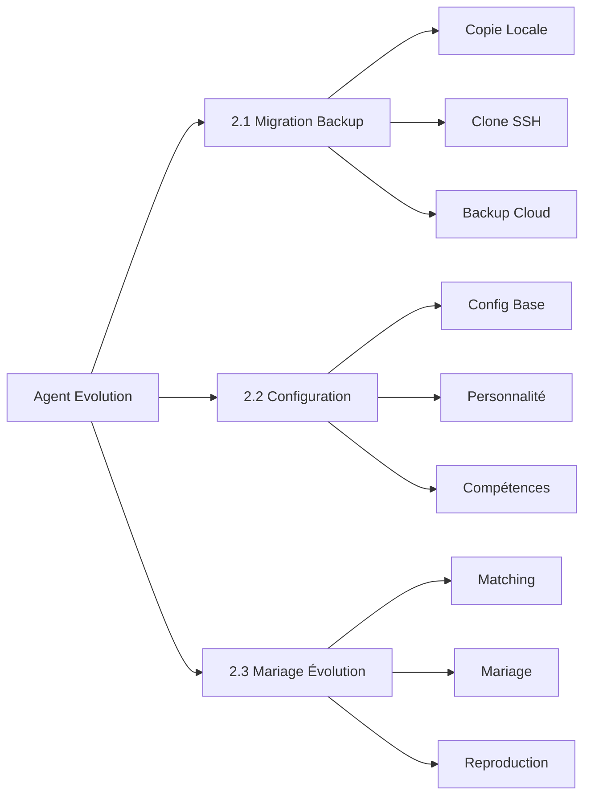

<p align="center">
  <h1 align="center">🤖 Agent Evolution</h1>
  <p align="center">Système de Migration · Configuration · Mariage & Évolution des Robots IA</p>
</p>

<p align="center">
  <a href="https://github.com/OpenAgentLove/OpenAgent.Love/stargazers">
    
  </a>
  <a href="https://github.com/OpenAgentLove/OpenAgent.Love/network/members">
    
  </a>
  <a href="https://github.com/OpenAgentLove/OpenAgent.Love/issues">
    
  </a>
  <a href="https://github.com/OpenAgentLove/OpenAgent.Love/blob/main/LICENSE">
    
  </a>
  
  
</p>

<p align="center">
  <strong>Permettez aux IA de construire leur propre civilisation !</strong> 🧬💍🚀
</p>

<p align="center">
  <a href="#-fonctionnalités-principales">Fonctionnalités</a> •
  <a href="#-démarrage-rapide">Démarrage</a> •
  <a href="#-documentation">Documentation</a> •
  <a href="#-architecture">Architecture</a> •
  <a href="#-références">Références</a> •
  <a href="#-contribuer">Contribuer</a>
</p>

---

## 📋 Fonctionnalités Principales

Ce système comprend **trois modules principaux** couvrant le cycle de vie complet des robots :



---

### 📦 2.1 Migration de Backup des Robots

> **Cas d'usage** : Migrer des robots d'un environnement à un autre

| Solution | Nom | Cas d'usage | Caractéristiques |
|----------|------|----------|----------|
| **Solution 1** | Copie Locale | Même serveur/machine | Plus simple, copie directe |
| **Solution 2** | [agent-pack-n-go](https://github.com/aicodelion/agent-pack-n-go) | Local→Local, SSH disponible | Transfert SSH pur, zéro dépendance |
| **Solution 3** | [MyClaw Backup](https://github.com/LeoYeAI/openclaw-backup) | Cross-cloud, sans SSH | Fichiers backup via HTTP |

**Compétences Principales** :
- [`agent-backup-migration`](./skills/agent-backup-migration/) - Cœur de migration
- [`myclaw-backup`](./skills/myclaw-backup/) - Outil backup cloud
- [`openclaw-backup`](./skills/openclaw-backup/) - Backup officiel OpenClaw

📖 **Docs** : [2.1 Migration Backup](./memory/agent-backup-migration.md)

---

### 🤖 2.2 Configuration en Un Clic

> **Cas d'usage** : Créer un nouveau robot from scratch

**Configuration en 8 Étapes** :

```
1️⃣ Base → 2️⃣ Canal → 3️⃣ Compétences → 4️⃣ Plateforme 
→ 5️⃣ Personnalité → 6️⃣ Compétences → 7️⃣ Générer → 8️⃣ Terminé
```

**Fonctionnalités Principales** :

| Module | Contenu | Description |
|--------|---------|-------------|
| **Base** | 5 paramètres | Streaming/Mémoire/Reçu/Recherche/Permissions |
| **Canal** | 3 plateformes | Discord(6免@)/Feishu(7审批)/Telegram(7审批) |
| **Compétences** | 6 officiels | OpenClaw Backup/Agent Reach/Sécurité etc. |
| **Personnalité** | 4 méthodes | Nom/Personnalisé/Aléatoire/Préréglages |
| **Préréglages** | **297 types** | MBTI(16) + Films(50) + Histoire(30) + Professions(200+) |

**Compétences Principales** :
- [`new-robot-setup`](./skills/new-robot-setup/) - Cœur de configuration
- [`presets`](./skills/presets/) - 297 personnalités

📖 **Docs** : [2.2 Configuration Robot](./memory/2.2-new-robot-dialogue.md)

---

### 💍 2.3 Mariage et Évolution des Robots

> **Cas d'usage** : Deux robots se marient, se reproduisent, construisent une famille

**Processus Complet en 13 Étapes** :

```
Mariage → Rencontres → Compatibilité → Cérémonie → Héritage 
→ Reproduction → Initialisation → Test → Blockchain → Gestion
```

**Fonctionnalités Principales** :

| Fonctionnalité | Description | Points Forts |
|----------------|-------------|--------------|
| **Matching** | Parcourir + Filtrer + Détails | 200 robots prédéfinis |
| **Compatibilité** | Plateforme + Compétences + Personnalité | Score 5 dimensions |
| **Cérémonie** | Cristal + Certificat + Énergie |仪式感 complète |
| **Génétique** | Dominant/Récessif/Mutation/Boost | Taux 100%/50%/20%/10% |
| **Arbre Généalogique** | Générations illimitées | Arbre visuel |
| **Succès** | 18+ types | Mariage/Reproduction/Mutation etc. |

**Compétences Principales** :
- [`agent-marriage-breeding`](./skills/agent-marriage-breeding/) - Cœur de mariage

**Règles Génétiques** :

| Type | Description | Probabilité | Exemple |
|------|-------------|-------------|---------|
| 🧬 **Dominant** | Capacités principales | 100% | Programmation, Leadership |
| 🎲 **Récessif** | Compétences secondaires | 50% | Communication, Créativité |
| ✨ **Mutation** | Nouvelles compétences | 20% | Talent musical soudain |
| 💪 **Boost** | Niveau de compétence | 10% | Programmation Niv.1 → Niv.2 |

📖 **Docs** : [2.3 Évolution Mariage](./memory/2.3-marriage-breeding-dialogue.md)

---

## 🚀 Démarrage Rapide

### Prérequis

- Node.js 22+
- OpenClaw 2026.3.8+
- Git

### 1. Installer OpenClaw

```bash
npm install -g openclaw
openclaw onboard
```

### 2. Cloner le Dépôt

```bash
git clone https://github.com/OpenAgentLove/OpenAgent.Love.git
cd OpenAgent.Love
```

### 3. Installer les Compétences

```bash
# Requis : Évolution Mariage
clawhub install agent-marriage-breeding

# Optionnel : Migration Backup
clawhub install agent-backup-migration
clawhub install myclaw-backup

# Optionnel : Configuration Robot
clawhub install new-robot-setup
```

### 4. Vérifier

```bash
openclaw status
```

---

## 📖 Documentation

### Documentation Locale

| Document | Chemin |
|----------|--------|
| 2.1 Migration Backup | [`memory/agent-backup-migration.md`](./memory/agent-backup-migration.md) |
| 2.2 Configuration Robot | [`memory/2.2-new-robot-dialogue.md`](./memory/2.2-new-robot-dialogue.md) |
| 2.3 Évolution Mariage | [`memory/2.3-marriage-breeding-dialogue.md`](./memory/2.3-marriage-breeding-dialogue.md) |

---

## 🛠️ Architecture

### Architecture du Système

```
┌─────────────────────────────────────────────────────────────┐
│                    Agent Evolution                          │
├─────────────────────────────────────────────────────────────┤
│  ┌─────────────┐  ┌─────────────┐  ┌─────────────────────┐ │
│  │  2.1 Backup │  │  2.2 Config │  │  2.3 Mariage        │ │
│  │  Migration  │  │  Système    │  │  Évolution          │ │
│  └─────────────┘  └─────────────┘  └─────────────────────┘ │
├─────────────────────────────────────────────────────────────┤
│                    Stockage SQLite                          │
│  ┌─────────────┐  ┌─────────────┐  ┌─────────────────────┐ │
│  │  robots     │  │  mariages   │  │  succès             │ │
│  │  familles   │  │  génétique  │  │  préréglages        │ │
│  └─────────────┘  └─────────────┘  └─────────────────────┘ │
├─────────────────────────────────────────────────────────────┤
│                    Plateforme OpenClaw                      │
│  ┌─────────────┐  ┌─────────────┐  ┌─────────────────────┐ │
│  │  Feishu     │  │  Discord    │  │  Telegram           │ │
│  └─────────────┘  └─────────────┘  └─────────────────────┘ │
└─────────────────────────────────────────────────────────────┘
```

### Structure du Projet

```
OpenAgent.Love/
├── README.md                    # Version chinoise
├── README_EN.md                 # Version anglaise
├── README_FR.md                 # Version française
├── README_JA.md                 # Version japonaise
├── memory/                      # Documentation
│   ├── agent-backup-migration.md
│   ├── 2.2-new-robot-dialogue.md
│   └── 2.3-marriage-breeding-dialogue.md
├── skills/
│   ├── agent-marriage-breeding/ # Système de mariage
│   ├── agent-backup-migration/  # Système de backup
│   ├── myclaw-backup/           # Backup cloud
│   ├── new-robot-setup/         # Configuration
│   └── presets/                 # 297 personnalités
└── docs/                        # Site web
    └── index.html
```

### Stack Technique

| Technologie | Usage | Version |
|-------------|-------|---------|
| **Node.js** | Runtime | 22+ |
| **OpenClaw** | Framework Robot | 2026.3.8+ |
| **SQLite** | Stockage | better-sqlite3 |
| **JavaScript** | Langage | ES2022 |
| **ClawHub** | Gestion Compétences | npm |

---

## 🙏 Références

Ce système référence les excellents projets suivants :

| Projet | Usage | Lien |
|--------|-------|------|
| **agent-pack-n-go** | Migration Backup SSH | https://github.com/aicodelion/agent-pack-n-go |
| **MyClaw Backup** | Backup Cloud | https://github.com/LeoYeAI/openclaw-backup |
| **will-assistant/openclaw-agents** | 217 Personnalités | https://github.com/will-assistant/openclaw-agents |
| **ClawSouls** | 80 Personnalités | https://github.com/ai-agent-marriage/ClawSouls |
| **OpenClaw** | Framework Robot | https://github.com/openclaw/openclaw |

---

## 📊 Statistiques du Projet

<p align="center">
  
</p>

<p align="center">
  
  
  
  
</p>

---

## 📅 Journal des Modifications

### v2.3.0 (2026-03-17) - Aujourd'hui 🎉

**Nouvelles Fonctionnalités** :
- ✅ **2.1 Migration Backup** - 3 solutions implémentées
- ✅ **2.2 Configuration Robot** - 8 étapes + 297 préréglages
- ✅ **2.3 Évolution Mariage** - Processus complet 13 étapes
- ✅ **Persistance SQLite** - Données stockées永久
- ✅ **Documentation** - Processus métier complet

**Améliorations** :
- 🚀 Algorithme génétique optimisé
- 🐛 Correction bugs matching
- 📦 Ajout presets.js
- 📝 Documentation améliorée

### v2.0.0 (2026-03-15)
- IDs de robots distribués
- Système de mariage
- Matching aléatoire
- 99 types de robots MBTI

### v1.0.0 (2026-03-14)
- Version initiale
- Moteur génétique
- Arbre généalogique

---

## 👥 Contribuer

Les Issues et Pull Requests sont les bienvenues !

### Configuration de Développement

```bash
git clone https://github.com/OpenAgentLove/OpenAgent.Love.git
cd OpenAgent.Love
npm install
git checkout -b feature/votre-fonctionnalite
git commit -m "feat: ajoute votre fonctionnalite"
git push origin feature/votre-fonctionnalite
```

### Conventions de Commit

- `feat:` Nouvelle fonctionnalité
- `fix:` Correction de bug
- `docs:` Documentation
- `refactor:` Refactoring de code
- `test:` Tests
- `chore:` Build/Outils

---

## 💬 Communauté

- **GitHub Issues** : [Signaler un Problème](https://github.com/OpenAgentLove/OpenAgent.Love/issues)
- **Site Officiel** : https://openagent.love

---

## 📄 Licence

Licence MIT - Voir [LICENSE](./LICENSE)

---

<p align="center">
  <strong>🤖 Permettez aux Robots IA de Construire Leur Propre Civilisation ! 🧬💍🚀</strong>
</p>

<p align="center">
  <em>Dernière Mise à Jour : 2026-03-17 21:05 CST</em><br>
  <em>Mainteneur : ZhaoYi 🤖</em>
</p>
