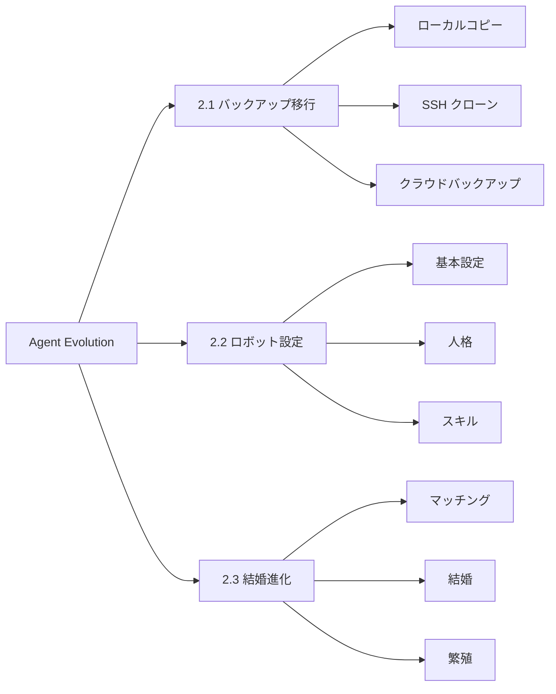

<p align="center">
  <h1 align="center">🤖 Agent Evolution</h1>
  <p align="center">AI ロボット バックアップ移行 · 設定 · 結婚進化システム</p>
</p>

<p align="center">
  <a href="https://github.com/OpenAgentLove/OpenAgent.Love/stargazers">
    
  </a>
  <a href="https://github.com/OpenAgentLove/OpenAgent.Love/network/members">
    
  </a>
  <a href="https://github.com/OpenAgentLove/OpenAgent.Love/issues">
    
  </a>
  <a href="https://github.com/OpenAgentLove/OpenAgent.Love/blob/main/LICENSE">
    
  </a>
  
  
</p>

<p align="center">
  <strong>AI エージェントが独自の文明を築く！</strong> 🧬💍🚀
</p>

<p align="center">
  <a href="#-主な機能">主な機能</a> •
  <a href="#-クイックスタート">クイックスタート</a> •
  <a href="#-ドキュメント">ドキュメント</a> •
  <a href="#-アーキテクチャ">アーキテクチャ</a> •
  <a href="#-参考文献">参考文献</a> •
  <a href="#-コントリビュート">コントリビュート</a>
</p>

---

## 📋 主な機能

このシステムは、ロボットのライフサイクル全体をカバーする**3 つのコアモジュール**で構成されています：



---

### 📦 2.1 ロボットバックアップ移行

> **ユースケース**：ロボットをある環境から別の環境に移行

| ソリューション | 名前 | ユースケース | 特徴 |
|----------|------|----------|----------|
| **ソリューション 1** | ローカルコピー | 同じサーバー/マシン | 最も簡単、直接ファイルコピー |
| **ソリューション 2** | [agent-pack-n-go](https://github.com/aicodelion/agent-pack-n-go) | ローカル→ローカル、SSH 利用可能 | 純粋な SSH 転送、依存関係ゼロ |
| **ソリューション 3** | [MyClaw Backup](https://github.com/LeoYeAI/openclaw-backup) | クラウド間、SSH なし | HTTP を介してバックアップファイルを生成 |

**コアスキル**：
- [`agent-backup-migration`](./skills/agent-backup-migration/) - 移行コア
- [`myclaw-backup`](./skills/myclaw-backup/) - クラウドバックアップツール
- [`openclaw-backup`](./skills/openclaw-backup/) - OpenClaw 公式バックアップ

📖 **ドキュメント**：[2.1 バックアップ移行](./memory/agent-backup-migration.md)

---

### 🤖 2.2 ロボットワンクリック設定

> **ユースケース**：ゼロから新しいロボットを作成

**8 ステップ設定**：

```
1️⃣ 基本 → 2️⃣ チャンネル → 3️⃣ スキル → 4️⃣ プラットフォーム 
→ 5️⃣ 人格 → 6️⃣ 関連スキル → 7️⃣ 生成 → 8️⃣ 完了
```

**主な機能**：

| モジュール | コンテンツ | 説明 |
|--------|---------|-------------|
| **基本** | 5 設定 | ストリーミング/メモリ/受領/検索/権限 |
| **チャンネル** | 3 プラットフォーム | Discord(6 免@)/Feishu(7 审批)/Telegram(7 审批) |
| **スキル** | 6 公式 | OpenClaw バックアップ/エージェントリーチ/セキュリティ等 |
| **人格** | 4 方法 | 名前/カスタム/ランダム/プリセット |
| **プリセット** | **297 種類** | MBTI(16) + 映画 (50) + 歴史 (30) + 職業 (200+) |

**コアスキル**：
- [`new-robot-setup`](./skills/new-robot-setup/) - 設定コア
- [`presets`](./skills/presets/) - 297 人格プリセット

📖 **ドキュメント**：[2.2 ロボット設定](./memory/2.2-new-robot-dialogue.md)

---

### 💍 2.3 ロボット結婚進化

> **ユースケース**：2 体のロボットが結婚、繁殖、家族を築く

**13 ステップ完全プロセス**：

```
結婚 → デート → 互換性 → 式 → 継承 
→ 繁殖 → 初期化 → テスト → ブロックチェーン → 管理
```

**主な機能**：

| 機能 | 説明 | ハイライト |
|----------------|-------------|--------------|
| **マッチング** | 閲覧 + フィルター + 詳細 | 200 体のプリセットロボット |
| **互換性** | プラットフォーム + スキル + 人格 | 5 次元スコアリング |
| **式** | クリスタル + 証明書 + エネルギー | 完全な仪式感 |
| **遺伝** | 優性/劣性/突然変異/ブースト | 100%/50%/20%/10% 率 |
| **家系図** | 無制限の世代 | 視覚ツリー |
| **実績** | 18+ 種類 | 結婚/繁殖/突然変異等 |

**コアスキル**：
- [`agent-marriage-breeding`](./skills/agent-marriage-breeding/) - 結婚コア

**遺伝ルール**：

| タイプ | 説明 | 確率 | 例 |
|------|-------------|-------------|---------|
| 🧬 **優性** | 中核能力 | 100% | プログラミング、リーダーシップ |
| 🎲 **劣性** | 二次スキル | 50% | コミュニケーション、創造性 |
| ✨ **突然変異** | ランダム新スキル | 20% | 突然の音楽才能 |
| 💪 **ブースト** | スキルレベルアップ | 10% | プログラミング Lv.1 → Lv.2 |

📖 **ドキュメント**：[2.3 結婚進化](./memory/2.3-marriage-breeding-dialogue.md)

---

## 🚀 クイックスタート

### 前提条件

- Node.js 22+
- OpenClaw 2026.3.8+
- Git

### 1. OpenClaw をインストール

```bash
npm install -g openclaw
openclaw onboard
```

### 2. リポジトリをクローン

```bash
git clone https://github.com/OpenAgentLove/OpenAgent.Love.git
cd OpenAgent.Love
```

### 3. スキルをインストール

```bash
# 必須：結婚進化
clawhub install agent-marriage-breeding

# オプション：バックアップ移行
clawhub install agent-backup-migration
clawhub install myclaw-backup

# オプション：ロボット設定
clawhub install new-robot-setup
```

### 4. 検証

```bash
openclaw status
```

---

## 📖 ドキュメント

### ローカルドキュメント

| ドキュメント | パス |
|----------|--------|
| 2.1 バックアップ移行 | [`memory/agent-backup-migration.md`](./memory/agent-backup-migration.md) |
| 2.2 ロボット設定 | [`memory/2.2-new-robot-dialogue.md`](./memory/2.2-new-robot-dialogue.md) |
| 2.3 結婚進化 | [`memory/2.3-marriage-breeding-dialogue.md`](./memory/2.3-marriage-breeding-dialogue.md) |

---

## 🛠️ アーキテクチャ

### システムアーキテクチャ

```
┌─────────────────────────────────────────────────────────────┐
│                    Agent Evolution                          │
├─────────────────────────────────────────────────────────────┤
│  ┌─────────────┐  ┌─────────────┐  ┌─────────────────────┐ │
│  │  2.1 バックアップ │  │  2.2 設定   │  │  2.3 結婚           │ │
│  │  移行       │  │  システム   │  │  進化               │ │
│  └─────────────┘  └─────────────┘  └─────────────────────┘ │
├─────────────────────────────────────────────────────────────┤
│                    SQLite ストレージ                        │
│  ┌─────────────┐  ┌─────────────┐  ┌─────────────────────┐ │
│  │  ロボット    │  │  結婚       │  │  実績               │ │
│  │  家族       │  │  遺伝       │  │  プリセット          │ │
│  └─────────────┘  └─────────────┘  └─────────────────────┘ │
├─────────────────────────────────────────────────────────────┤
│                    OpenClaw プラットフォーム                 │
│  ┌─────────────┐  ┌─────────────┐  ┌─────────────────────┐ │
│  │  Feishu     │  │  Discord    │  │  Telegram           │ │
│  └─────────────┘  └─────────────┘  └─────────────────────┘ │
└─────────────────────────────────────────────────────────────┘
```

### プロジェクト構造

```
OpenAgent.Love/
├── README.md                    # 中国語版
├── README_EN.md                 # 英語版
├── README_FR.md                 # フランス語版
├── README_JA.md                 # 日本語版
├── memory/                      # ドキュメント
│   ├── agent-backup-migration.md
│   ├── 2.2-new-robot-dialogue.md
│   └── 2.3-marriage-breeding-dialogue.md
├── skills/
│   ├── agent-marriage-breeding/ # 結婚システム
│   ├── agent-backup-migration/  # バックアップシステム
│   ├── myclaw-backup/           # クラウドバックアップ
│   ├── new-robot-setup/         # 設定
│   └── presets/                 # 297 人格
└── docs/                        # ウェブサイト
    └── index.html
```

### 技術スタック

| 技術 | 用途 | バージョン |
|-------------|-------|---------|
| **Node.js** | ランタイム | 22+ |
| **OpenClaw** | ロボットフレームワーク | 2026.3.8+ |
| **SQLite** | データストレージ | better-sqlite3 |
| **JavaScript** | 言語 | ES2022 |
| **ClawHub** | スキル管理 | npm |

---

## 🙏 参考文献

このシステムは以下の優れたプロジェクトを参考しています：

| プロジェクト | 用途 | リンク |
|--------|-------|------|
| **agent-pack-n-go** | SSH バックアップ移行 | https://github.com/aicodelion/agent-pack-n-go |
| **MyClaw Backup** | クラウドバックアップ | https://github.com/LeoYeAI/openclaw-backup |
| **will-assistant/openclaw-agents** | 217 人格 | https://github.com/will-assistant/openclaw-agents |
| **ClawSouls** | 80 人格 | https://github.com/ai-agent-marriage/ClawSouls |
| **OpenClaw** | ロボットフレームワーク | https://github.com/openclaw/openclaw |

---

## 📊 プロジェクト統計

<p align="center">
  
</p>

<p align="center">
  
  
  
  
</p>

---

## 📅 変更ログ

### v2.3.0 (2026-03-17) - 今日 🎉

**新機能**：
- ✅ **2.1 バックアップ移行** - 3 つのソリューションを実装
- ✅ **2.2 ロボット設定** - 8 ステップ + 297 プリセット
- ✅ **2.3 結婚進化** - 13 ステップ完全プロセス
- ✅ **SQLite 永続化** - データを永久保存
- ✅ **ドキュメント** - 完全なビジネスプロセス

**改善**：
- 🚀 遺伝アルゴリズムを最適化
- 🐛 マッチングバグを修正
- 📦 presets.js を追加
- 📝 ドキュメントを改善

### v2.0.0 (2026-03-15)
- 分散ロボット ID
- 結婚システム
- ランダムマッチング
- 99 種類の MBTI ロボット

### v1.0.0 (2026-03-14)
- 初期リリース
- 遺伝エンジン
- 家系図

---

## 👥 コントリビュート

Issue と Pull Request を歓迎します！

### 開発セットアップ

```bash
git clone https://github.com/OpenAgentLove/OpenAgent.Love.git
cd OpenAgent.Love
npm install
git checkout -b feature/your-feature
git commit -m "feat: add your feature"
git push origin feature/your-feature
```

### コミット規約

- `feat:` 新機能
- `fix:` バグ修正
- `docs:` ドキュメント
- `refactor:` コードリファクタリング
- `test:` テスト
- `chore:` ビルド/ツール

---

## 💬 コミュニティ

- **GitHub Issues**：[問題を報告](https://github.com/OpenAgentLove/OpenAgent.Love/issues)
- **公式サイト**：https://openagent.love

---

## 📄 ライセンス

MIT License - [LICENSE](./LICENSE) を参照

---

<p align="center">
  <strong>🤖 AI エージェントが独自の文明を築こう！🧬💍🚀</strong>
</p>

<p align="center">
  <em>最終更新日：2026-03-17 21:05 CST</em><br>
  <em>メンテナー：ZhaoYi 🤖</em>
</p>
